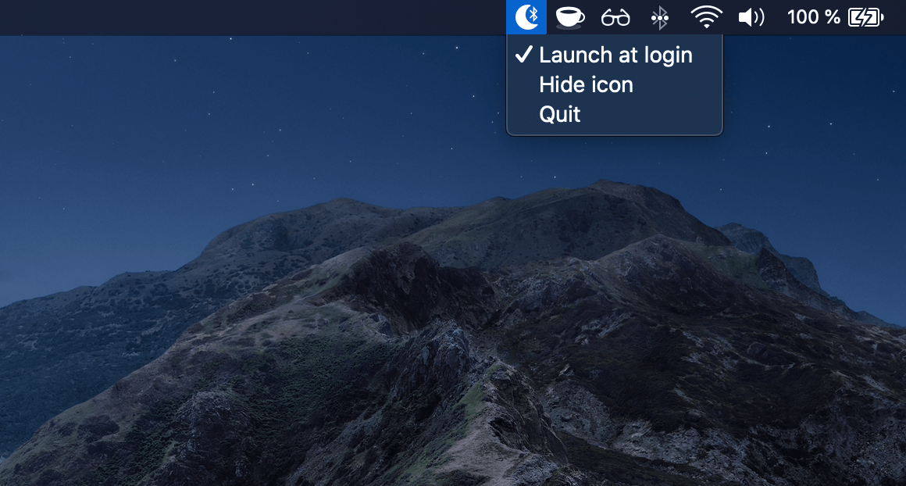

# Bluesnooze

[Download the latest release][download-latest] or install via Homebrew:

```sh
brew install bluesnooze
```

Please note the latest release requires MacOS Monterey (12.0) or higher.

## Enjoying Bluesnooze? ❤️

Perhaps you could [buy me a coffee](https://www.buymeacoffee.com/odlp) to say thanks :coffee:

## About

**Bluesnooze prevents your sleeping Mac from connecting to Bluetooth accessories.**

If you pair Bluetooth headphones or speakers with both your phone & Mac it can be frustrating when your sleeping Mac connects intermittently and disrupts the audio.

With Bluesnooze the Bluetooth connection is switched off when your Mac sleeps, and switched on when your Mac wakes.



You might also want to check-out Whisper –  [the volume limiter for MacOS](https://apps.apple.com/gb/app/whisper-volume-limiter/id1438132944?mt=12).

## Installation

1. Download `Bluesnooze.zip` from the [latest release][download-latest]
1. In Finder, open `Bluesnooze.zip` in your `Downloads` directory
1. Drag `Bluesnooze.app` to your `Applications` directory
1. *Optional*: Configure 'Launch at login'

## Caveats

- Please note this app is not compatible with the “Allow your Apple Watch to unlock your Mac” feature.
- Unfortunately this app can't be distributed via the App Store because it uses a private API to switch Bluetooth on/off (but the release version is notarized by Apple).

[download-latest]: https://github.com/odlp/bluesnooze/releases/latest

## FAQs

### Can you add support for selectively disconnecting certain devices?

Bluesnooze is a really simple app which toggles the Bluetooth power on/off.
Disconnecting specific devices would require a complete rewrite, and I don't
need this functionality or the complexity it brings. Please feel free to fork &
experiment as you like ✌️

### How can I hide the Bluesnooze icon?

In your terminal run the following command:

```sh
killall Bluesnooze && defaults write com.oliverpeate.Bluesnooze hideIcon -bool true
```

When you next relaunch the application there should be no icon in the menu bar.

### How can I restore the Bluesnooze icon?

In your terminal run the following command:

```sh
killall Bluesnooze && defaults delete com.oliverpeate.Bluesnooze hideIcon
```

When you next relaunch the application it should appear in the menu bar.
